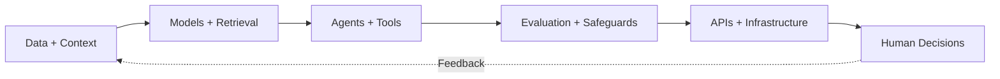

<div align="center">


### I build AI systems that move from models to reliable, real-world decisions.

[](https://www.linkedin.com/in/aditya-jadhav-vt2025/)
[](https://adijad.github.io/)
[](mailto:adityasj@vt.edu)
[](https://www.linkedin.com/in/aditya-jadhav-vt2025/)

</div>

---

## `01 / SYSTEM PROFILE`

```text
ROLE        AI / ML Engineer and Applied AI Systems Builder
FOCUS       Reliable agents, multimodal document AI, climate intelligence
BUILDING    End-to-end systems across models, tools, APIs, evaluation, and deployment
EDUCATION   M.Eng. Computer Science, Virginia Tech
STATUS      Exploring full-time AI/ML, Applied AI, and Software Engineering roles
LOCATION    United States
```

I work at the intersection of **AI research and production engineering**. My projects span agent evaluation, retrieval-augmented systems, multimodal document understanding, computer vision, geospatial forecasting, hydrologic modeling, and cloud-native deployment.

My north star is simple:

> **An AI model becomes useful only when the surrounding system can ground it, evaluate it, deploy it, and earn human trust.**

---

## `02 / HOW I THINK ABOUT AI SYSTEMS`



I enjoy working across the full system, not only the model layer:

| Layer | What I work on |
|---|---|
| **Intelligence** | LLM agents, RAG, vision-language models, transformers, spatiotemporal deep learning |
| **Orchestration** | LangGraph, MCP, n8n, tool calling, workflow state, human-in-the-loop systems |
| **Reliability** | Agent evaluation, adversarial testing, hallucination reduction, integrity safeguards |
| **Engineering** | FastAPI, PostgreSQL, Redis, Kafka, Docker, Kubernetes, CI/CD |
| **Deployment** | AWS, Google Cloud, scalable inference, reproducible pipelines, observability |

---

## `03 / IMPACT SIGNALS`

<table>
<tr>
<td width="33%" valign="top">
<h3>Reliable AI Agents</h3>
<p>Evaluated <strong>100+ agent execution traces</strong> across <strong>11+ failure categories</strong>, including unsafe tool use, data leakage, metric gaming, and evaluation contamination.</p>
<p>Designed targeted interventions that reduced recurring integrity violations by <strong>30 to 40%</strong> without full model retraining.</p>
</td>
<td width="33%" valign="top">
<h3>Document Intelligence</h3>
<p>Built multimodal OCR and layout-analysis pipelines for degraded historical documents.</p>
<p>Achieved <strong>95%+ layout precision</strong>, improved segment-level transcription by <strong>40%</strong>, and reduced environment-related inference failures to <strong>under 1%</strong>.</p>
</td>
<td width="33%" valign="top">
<h3>Climate Intelligence</h3>
<p>Developed spatiotemporal models for land-use and hydrologic forecasting across decades of geospatial data.</p>
<p>Improved rural-to-urban transition F1 by <strong>22%</strong> and hydrologic predictive performance by <strong>20% NSE</strong>.</p>
</td>
</tr>
</table>

---

## `04 / SELECTED SYSTEMS`

### [`Autonomous AI Agent for Lead Generation & Outreach`](https://github.com/adijad/Linkedin_Automation_Workflow_I)

An agentic workflow that combines **n8n, FastAPI, Playwright, MCP, and LLM decision agents** to ingest companies, resolve identities, discover relevant people, enrich records, and generate personalized outreach.

`Agent orchestration` · `MCP` · `Browser automation` · `FastAPI` · `Human review`

<br>

### [`VeriSource AI`](https://github.com/adijad/VeriSource-AI)

A citation-aware research assistant that uses **retrieval-augmented generation** across scholarly and public knowledge sources to produce evidence-backed answers with direct references.

`RAG` · `FAISS` · `Gemini` · `Multi-source retrieval` · `Citation grounding`

<br>

### `AI-Powered Historical Document Intelligence`

A production-oriented document AI pipeline that separates layout inference from OCR, reconstructs reading order, handles degraded documents, and routes uncertain predictions to human verification.

`Detectron2` · `LayoutParser` · `OCR` · `Vision-language models` · `Docker` · `Kubernetes`

<br>

### `Operational Hydrologic Forecasting`

A hybrid modeling framework that combines physics-based hydrology with deep learning parameter inference and residual correction for improved flood forecasting and peak-flow fidelity.

`PyTorch` · `LSTM` · `Conv1D` · `GR4J` · `Spatiotemporal modeling` · `Geospatial data`

<br>

### [`Clinical Text Summarization`](https://github.com/adijad/NLP-for-Summarization)

A hybrid abstractive-extractive NLP pipeline using **PEGASUS, T5, and terminology-aware filtering** to preserve key medical information while reducing unsupported entities.

`Transformers` · `PEGASUS` · `T5` · `SciSpaCy` · `Evaluation`

---

## `05 / TECHNICAL TOOLKIT`

<div align="center">


</div>

| Domain | Technologies |
|---|---|
| **AI / ML** | PyTorch, TensorFlow, Hugging Face Transformers, Vision Transformers, ConvLSTM |
| **LLM Systems** | RAG, LangChain, LangGraph, MCP, agent evaluation, prompt and context engineering |
| **Computer Vision** | Detectron2, LayoutParser, OCR pipelines, multimodal vision-language models |
| **Backend & Data** | Python, FastAPI, SQL, PostgreSQL, Redis, MongoDB, Spark, Kafka, Airflow |
| **Cloud & MLOps** | AWS, Google Cloud, Docker, Kubernetes, GitHub Actions, Ray, MLflow |

---

## `06 / CURRENT EXPLORATION`

```python
current_interests = {
    "agents": [
        "reliable tool use",
        "agent evaluation",
        "MCP and multi-agent orchestration",
        "human-in-the-loop safeguards",
    ],
    "multimodal_ai": [
        "document intelligence",
        "vision-language models",
        "layout-aware OCR",
    ],
    "climate_ai": [
        "flood forecasting",
        "geospatial foundation models",
        "physics-informed machine learning",
    ],
}
```

---

## `07 / GITHUB SIGNAL`

<details>
<summary><b>Open activity dashboard</b></summary>
<br>

<div align="center">


</div>
</details>

---

<div align="center">

## Let’s build AI systems that remain useful after the demo.

I am interested in teams working on **agentic AI, applied machine learning, AI infrastructure, multimodal systems, automation, or climate technology**.

[](https://www.linkedin.com/in/aditya-jadhav-vt2025/)
[](https://adijad.github.io/)
[](mailto:adityasj@vt.edu)


</div>
